# Detailed Solution Architecture
## AI-Powered IT Operations Platform on GCP

---

## Architecture Overview

### High-Level Architecture Diagram

```mermaid
graph TB
    subgraph "Data Sources"
        A1[🎫 BMC Remedy]
        A2[🎫 BMC Helix]
        A3[🎫 Jira Service Management]
        A4[☁️ GCP Project 1]
        A5[☁️ GCP Project 2-30]
        A6[🌐 SaaS: Braze, Storyblok]
    end

    subgraph "Ingestion Layer"
        B1[📡 Cloud Functions<br/>Ticket API Connectors]
        B2[📊 Cloud Logging<br/>Log Aggregation]
        B3[🔄 Pub/Sub<br/>Event Streaming]
    end

    subgraph "Storage Layer"
        C1[💾 BigQuery<br/>Hot Storage 90d]
        C2[🗄️ Cloud Storage<br/>Archive 7yr]
        C3[🗃️ Cloud SQL<br/>Metadata Store]
        C4[🔍 Firestore<br/>Correlation Cache]
    end

    subgraph "AI/ML Processing Layer"
        D1[🤖 BigQuery ML<br/>Text Embeddings]
        D2[🧠 Gemini API<br/>Text-to-SQL NLQ]
        D3[📈 BigQuery ML<br/>K-Means Clustering]
        D4[📊 BigQuery ML<br/>ARIMA Plus Forecasting]
        D5[⚡ Cloud Functions<br/>Correlation Engine]
    end

    subgraph "Application Layer"
        E1[🖥️ Cloud Run<br/>Ticket Management API]
        E2[🔎 Cloud Run<br/>Log Query Service]
        E3[🔗 Cloud Run<br/>Correlation Service]
        E4[⚙️ Cloud Workflows<br/>Automation Engine]
    end

    subgraph "Presentation Layer"
        F1[📊 Looker Studio<br/>Operations Dashboard]
        F2[💬 Chat Interface<br/>Ask the Logs]
        F3[🎛️ Web UI<br/>Unified Ticket View]
        F4[📱 Mobile App<br/>Incident Response]
    end

    subgraph "Integration Layer"
        G1[🔐 Cloud IAM<br/>Identity & Access]
        G2[🔔 Cloud Monitoring<br/>Alerting]
        G3[💬 Slack/Teams<br/>Collaboration]
        G4[📚 CMDB Integration]
    end

    A1 & A2 & A3 --> B1
    A4 & A5 --> B2
    A6 --> B3
    B1 --> C3
    B1 & B3 --> C1
    B2 --> C1
    C1 --> C2
    
    C1 --> D1 & D2 & D3 & D4
    C3 --> D5
    
    D1 & D4 --> E1
    D2 & D3 --> E2
    D5 --> E3
    E1 & E2 & E3 --> E4
    
    E1 --> F3
    E2 --> F1 & F2
    E3 --> F3
    E4 --> F3
    
    F1 & F2 & F3 & F4 --> G1
    E2 & E3 --> G2
    E1 & E3 --> G3
    E1 --> G4

    style A1 fill:#e1f5ff
    style A2 fill:#e1f5ff
    style A3 fill:#e1f5ff
    style C1 fill:#fff3e0
    style D1 fill:#f3e5f5
    style D2 fill:#f3e5f5
    style F1 fill:#e8f5e9
    style F2 fill:#e8f5e9
```



---

## Detailed Component Architecture

### 1. Data Ingestion Architecture

```mermaid
graph LR
    subgraph "Ticket Systems"
        T1[BMC Remedy<br/>REST API]
        T2[BMC Helix<br/>REST API]
        T3[Jira JSM<br/>REST API]
    end

    subgraph "Ingestion Pipeline"
        I1[Cloud Scheduler<br/>⏰ Trigger every 5min]
        I2[Cloud Functions<br/>📡 API Connector]
        I3[Pub/Sub Topic<br/>ticket-ingestion]
        I4[Cloud Functions<br/>🔄 Normalizer]
        I5[Cloud Functions<br/>✨ Enrichment]
    end

    subgraph "Storage"
        S1[(BigQuery<br/>tickets_raw)]
        S2[(BigQuery<br/>tickets_normalized)]
        S3[(Cloud SQL<br/>ticket_metadata)]
    end

    T1 & T2 & T3 --> I2
    I1 -.trigger.-> I2
    I2 --> I3
    I3 --> I4
    I4 --> S1
    I4 --> I5
    I5 --> S2
    I5 --> S3

    style I2 fill:#4285f4,color:#fff
    style I4 fill:#4285f4,color:#fff
    style S2 fill:#fbbc04
```



### 2. Log Collection Architecture


### 3. AI/ML Processing Pipeline

```mermaid
graph TB
    subgraph "Input Data"
        I1[(BigQuery<br/>tickets_normalized)]
        I2[(BigQuery<br/>logs_hot)]
    end

    subgraph "Embedding Generation"
        E1[Vertex AI<br/>Text Embedding API<br/>text-embedding-004]
        E2[(BigQuery ML<br/>ticket_embeddings)]
        E3[(Vector Search<br/>Matching Engine)]
    end

    subgraph "ML Models"
        M1[BigQuery ML<br/>📊 K-Means Clustering<br/>Similar Tickets]
        M2[BigQuery ML<br/>🎯 Logistic Regression<br/>Ticket Categorization]
        M3[BigQuery ML<br/>🔮 ARIMA Plus<br/>Trend Forecasting]
        M4[BigQuery ML<br/>⚠️ Autoencoder<br/>Anomaly Detection]
    end

    subgraph "AI Services"
        A1[Gemini 1.5 Pro<br/>💬 Text-to-SQL]
        A2[Gemini 1.5 Pro<br/>📝 Root Cause<br/>Summarization]
        A3[Gemini 1.5 Flash<br/>⚡ Quick Analysis]
    end

    subgraph "Outputs"
        O1[Correlation Results]
        O2[Recommendations]
        O3[Automated Actions]
    end

    I1 --> E1
    E1 --> E2
    E2 --> E3
    
    I1 & I2 --> M1
    I1 --> M2
    I1 & I2 --> M3
    
    I2 --> A1
    I1 & I2 --> A2
    I2 --> A3
    
    E3 --> O1
    M1 & M2 & M3 --> O2
    A1 & A2 & A3 --> O2
    O2 --> O3

    style E1 fill:#f3e5f5
    style A1 fill:#e1bee7
    style A2 fill:#e1bee7
    style M1 fill:#c5cae9
```



---

## Data Flow Diagrams

### Ticket Processing Flow


### Log Analysis Flow

```mermaid
sequenceDiagram
    participant App as Application
    participant CL as Cloud Logging
    participant BQ as BigQuery
    participant User
    participant Gemini as Gemini API
    participant UI as Chat Interface

    App->>CL: Write logs
    CL->>BQ: Export via Log Sink
    
    User->>UI: Ask: "Show errors in last hour"
    UI->>Gemini: Convert to SQL prompt
    Note over Gemini: NL → SQL Translation
    Gemini-->>UI: Return SQL query
    UI->>BQ: Execute generated SQL
    BQ-->>UI: Return log results
    UI-->>User: Display results + explanation
    
    Note over BQ: Background Process
    BQ->>BQ: Run anomaly detection
    BQ->>BQ: Detect patterns
    BQ->>UI: Alert on anomalies
```



### Correlation Engine Flow


---

## Component Details

### Storage Architecture


### AI/ML Model Pipeline

```mermaid
graph LR
    subgraph "Training Pipeline - BigQuery ML Native"
        T1[Historical Data<br/>6+ months in BigQuery]
        T2[Feature Engineering<br/>SQL Queries]
        T3[Model Training<br/>CREATE MODEL]
        T4[Model Evaluation<br/>ML.EVALUATE]
        T5[Model Registry<br/>BigQuery Datasets]
    end

    subgraph "Inference Pipeline"
        I1[Real-time Data<br/>in BigQuery]
        I2[Feature Extraction<br/>SQL Views]
        I3[Model Prediction<br/>ML.PREDICT]
        I4[Results Materialization<br/>Scheduled Queries]
        I5[Results Cache<br/>Materialized Views]
    end

    subgraph "BigQuery ML Models"
        M1[🎯 K-Means<br/>Ticket Clustering<br/>CREATE MODEL USING K_MEANS]
        M2[📊 Logistic Regression<br/>Categorization<br/>CREATE MODEL USING LOGISTIC_REG]
        M3[🔮 ARIMA Plus<br/>Trend Forecasting<br/>CREATE MODEL USING ARIMA_PLUS]
        M4[⚠️ Autoencoder<br/>Anomaly Detection<br/>CREATE MODEL USING AUTOENCODER]
    end

    T1 --> T2 --> T3 --> T4 --> T5
    T5 --> M1 & M2 & M3 & M4
    
    I1 --> I2 --> I3
    M1 & M2 & M3 & M4 --> I3
    I3 --> I4 --> I5

    style T3 fill:#fbbc04
    style I3 fill:#fbbc04
```



---

## Security Architecture

```mermaid
graph TB
    subgraph "Identity & Access"
        I1[Cloud Identity<br/>🔐 SSO/SAML]
        I2[Cloud IAM<br/>Role-based Access]
        I3[Service Accounts<br/>App Identity]
        I4[Workload Identity<br/>GKE Authentication]
    end

    subgraph "Network Security"
        N1[VPC<br/>🛡️ Network Isolation]
        N2[Cloud Armor<br/>WAF/DDoS]
        N3[Private Service Connect<br/>Private APIs]
        N4[Cloud NAT<br/>Outbound only]
    end

    subgraph "Data Security"
        D1[CMEK<br/>🔑 Customer Keys]
        D2[Cloud KMS<br/>Key Management]
        D3[DLP API<br/>Sensitive Data]
        D4[VPC Service Controls<br/>Data Perimeter]
    end

    subgraph "Monitoring & Compliance"
        M1[Security Command Center<br/>👁️ Threat Detection]
        M2[Cloud Audit Logs<br/>📋 Activity Tracking]
        M3[Policy Intelligence<br/>Access Analytics]
        M4[Compliance Reports<br/>SOC2/ISO27001]
    end

    I1 --> I2
    I2 --> I3 & I4
    
    N1 --> N2 & N3 & N4
    
    D2 --> D1
    D1 --> D3
    D3 --> D4
    
    I2 --> M3
    N1 & D4 --> M1
    I3 --> M2
    M1 & M2 & M3 --> M4

    style D1 fill:#ea4335,color:#fff
    style M1 fill:#fbbc04
```



### Data Encryption Flow

```mermaid
graph LR
    subgraph "Data at Rest"
        R1[BigQuery Tables<br/>🔒 Default Encryption]
        R2[Cloud Storage<br/>🔒 CMEK Encryption]
        R3[Cloud SQL<br/>🔒 Encrypted Disks]
    end

    subgraph "Data in Transit"
        T1[TLS 1.3<br/>🔐 HTTPS/gRPC]
        T2[VPC Internal<br/>🔐 Encrypted by default]
        T3[Private Service Connect<br/>🔐 No internet exposure]
    end

    subgraph "Key Management"
        K1[Cloud KMS<br/>Master Keys]
        K2[HSM Integration<br/>Hardware Security]
        K3[Automatic Rotation<br/>90-day cycle]
    end

    K1 --> R1 & R2 & R3
    K2 --> K1
    K1 --> K3
    
    T1 --> T2 --> T3

    style K1 fill:#4285f4,color:#fff
    style T1 fill:#34a853,color:#fff
```



---

## Deployment Architecture

### Multi-Region Deployment


### Disaster Recovery Flow


---

## POC Simplified Architecture

```mermaid
graph TB
    subgraph "POC Scope - Simplified"
        P1[Jira JSM<br/>CSV Export<br/>1000 tickets]
        P2[GCP Projects 1-3<br/>Cloud Logging]
        
        P3[BigQuery<br/>🗄️ All data]
        
        P4[BigQuery ML<br/>🤖 Embeddings]
        P5[Gemini API<br/>💬 Text-to-SQL]
        
        P6[Looker Studio<br/>📊 Dashboard]
        P7[Simple UI<br/>Chat Demo]
    end

    P1 --> P3
    P2 --> P3
    P3 --> P4
    P3 --> P5
    P4 --> P6
    P5 --> P7
    P3 --> P6

    style P3 fill:#fbbc04
    style P4 fill:#f3e5f5
    style P5 fill:#e1bee7
    style P6 fill:#e8f5e9

    Note1[No complex pipelines<br/>No production APIs<br/>No multi-region<br/>CSV + BigQuery only]
    
    style Note1 fill:#fff9c4
```



---

## BigQuery ML Implementation Details

### Why BigQuery ML? ✅

**Advantages over Vertex AI for this use case:**
- ✅ **No data movement** - Models train where data lives
- ✅ **SQL-only** - No Python/coding required (perfect for POC)
- ✅ **Cost-effective** - No separate ML infrastructure
- ✅ **Fast iteration** - CREATE MODEL in minutes
- ✅ **Automatic scaling** - Built-in distributed training
- ✅ **Easy for junior resources** - SQL queries only

### Model 1: K-Means Clustering (Similar Tickets)


**Sample SQL:**
```sql
-- Step 1: Create K-Means model
CREATE OR REPLACE MODEL `project.dataset.ticket_clusters`
OPTIONS(
  model_type='KMEANS',
  num_clusters=20,
  kmeans_init_method='KMEANS++',
  distance_type='COSINE'
) AS
SELECT 
  CONCAT(title, ' ', description) AS text_features
FROM `project.dataset.tickets_normalized`;

-- Step 2: Predict clusters
SELECT 
  ticket_id,
  title,
  centroid_id AS cluster_id,
  NEAREST_CENTROIDS_DISTANCE[OFFSET(0)].distance AS distance_to_centroid
FROM ML.PREDICT(
  MODEL `project.dataset.ticket_clusters`,
  TABLE `project.dataset.tickets_normalized`
);

-- Step 3: Find similar tickets (same cluster)
WITH clustered_tickets AS (
  SELECT * FROM ML.PREDICT(...)
)
SELECT 
  t1.ticket_id,
  t2.ticket_id AS similar_ticket_id,
  t1.cluster_id,
  t2.title AS similar_title
FROM clustered_tickets t1
JOIN clustered_tickets t2 
  ON t1.cluster_id = t2.cluster_id
WHERE t1.ticket_id < t2.ticket_id;
```

### Model 2: ARIMA Plus (Trend Forecasting)


**Sample SQL:**
```sql
-- Step 1: Prepare time series data
CREATE OR REPLACE TABLE `project.dataset.ticket_timeseries` AS
SELECT 
  TIMESTAMP_TRUNC(created_date, HOUR) AS timestamp,
  priority,
  COUNT(*) AS ticket_count
FROM `project.dataset.tickets_normalized`
WHERE created_date >= DATE_SUB(CURRENT_DATE(), INTERVAL 180 DAY)
GROUP BY timestamp, priority;

-- Step 2: Create ARIMA model per priority
CREATE OR REPLACE MODEL `project.dataset.ticket_forecast_p1`
OPTIONS(
  model_type='ARIMA_PLUS',
  time_series_timestamp_col='timestamp',
  time_series_data_col='ticket_count',
  auto_arima=TRUE,
  data_frequency='HOURLY'
) AS
SELECT timestamp, ticket_count
FROM `project.dataset.ticket_timeseries`
WHERE priority = 'P1';

-- Step 3: Forecast next 7 days (168 hours)
SELECT
  forecast_timestamp,
  forecast_value AS predicted_tickets,
  confidence_interval_lower_bound,
  confidence_interval_upper_bound
FROM ML.FORECAST(
  MODEL `project.dataset.ticket_forecast_p1`,
  STRUCT(168 AS horizon, 0.95 AS confidence_level)
);

-- Step 4: Detect anomalies (actual vs predicted)
SELECT
  timestamp,
  ticket_count AS actual,
  forecast_value AS predicted,
  ABS(ticket_count - forecast_value) AS deviation,
  CASE 
    WHEN ticket_count > confidence_interval_upper_bound THEN 'HIGH_ANOMALY'
    WHEN ticket_count < confidence_interval_lower_bound THEN 'LOW_ANOMALY'
    ELSE 'NORMAL'
  END AS anomaly_type
FROM ML.DETECT_ANOMALIES(
  MODEL `project.dataset.ticket_forecast_p1`,
  STRUCT(0.95 AS anomaly_prob_threshold)
);
```

### Model 3: Text Embeddings + Similarity


**Sample SQL:**
```sql
-- Step 1: Create embedding model (uses Vertex AI internally)
CREATE OR REPLACE MODEL `project.dataset.ticket_embeddings`
REMOTE WITH CONNECTION `project.region.vertex-connection`
OPTIONS(
  ENDPOINT = 'text-embedding-004'
);

-- Step 2: Generate embeddings
CREATE OR REPLACE TABLE `project.dataset.ticket_vectors` AS
SELECT 
  ticket_id,
  title,
  ml_generate_embedding_result AS embedding
FROM ML.GENERATE_EMBEDDING(
  MODEL `project.dataset.ticket_embeddings`,
  (SELECT ticket_id, CONCAT(title, ' ', description) AS content
   FROM `project.dataset.tickets_normalized`)
);

-- Step 3: Find similar tickets using cosine similarity
WITH similarity_matrix AS (
  SELECT 
    t1.ticket_id AS ticket_id_1,
    t2.ticket_id AS ticket_id_2,
    t1.title AS title_1,
    t2.title AS title_2,
    ML.DISTANCE(t1.embedding, t2.embedding, 'COSINE') AS similarity_score
  FROM `project.dataset.ticket_vectors` t1
  CROSS JOIN `project.dataset.ticket_vectors` t2
  WHERE t1.ticket_id < t2.ticket_id
)
SELECT *
FROM similarity_matrix
WHERE similarity_score > 0.8  -- High similarity threshold
ORDER BY similarity_score DESC
LIMIT 100;
```

### Model 4: Logistic Regression (Categorization)


**Sample SQL:**
```sql
-- Step 1: Create classification model
CREATE OR REPLACE MODEL `project.dataset.ticket_classifier`
OPTIONS(
  model_type='LOGISTIC_REG',
  input_label_cols=['category'],
  auto_class_weights=TRUE
) AS
SELECT 
  CONCAT(title, ' ', description) AS text_features,
  priority,
  category
FROM `project.dataset.tickets_normalized`
WHERE category IS NOT NULL
  AND created_date >= DATE_SUB(CURRENT_DATE(), INTERVAL 180 DAY);

-- Step 2: Evaluate model
SELECT
  *
FROM ML.EVALUATE(
  MODEL `project.dataset.ticket_classifier`,
  (SELECT CONCAT(title, ' ', description) AS text_features,
          priority, category
   FROM `project.dataset.tickets_normalized`
   WHERE created_date BETWEEN DATE_SUB(CURRENT_DATE(), INTERVAL 30 DAY)
                          AND CURRENT_DATE())
);

-- Step 3: Predict categories for new tickets
SELECT
  ticket_id,
  title,
  predicted_category,
  predicted_category_probs[OFFSET(0)].prob AS confidence
FROM ML.PREDICT(
  MODEL `project.dataset.ticket_classifier`,
  (SELECT ticket_id, CONCAT(title, ' ', description) AS text_features, priority
   FROM `project.dataset.tickets_normalized`
   WHERE category IS NULL)
)
WHERE predicted_category_probs[OFFSET(0)].prob > 0.7;  -- High confidence only
```

### Model 5: Autoencoder (Anomaly Detection)


**Sample SQL:**
```sql
-- Step 1: Create features for anomaly detection
CREATE OR REPLACE TABLE `project.dataset.log_features` AS
SELECT 
  TIMESTAMP_TRUNC(timestamp, HOUR) AS hour,
  service_name,
  COUNT(*) AS log_count,
  COUNTIF(severity = 'ERROR') AS error_count,
  COUNTIF(severity = 'WARNING') AS warning_count,
  AVG(CAST(JSON_EXTRACT_SCALAR(json_payload, '$.latency_ms') AS FLOAT64)) AS avg_latency
FROM `project.dataset.logs_hot`
WHERE timestamp >= TIMESTAMP_SUB(CURRENT_TIMESTAMP(), INTERVAL 30 DAY)
GROUP BY hour, service_name;

-- Step 2: Create autoencoder model
CREATE OR REPLACE MODEL `project.dataset.log_anomaly_detector`
OPTIONS(
  model_type='AUTOENCODER',
  activation_fn='RELU',
  hidden_units=[64, 32, 64]
) AS
SELECT 
  log_count,
  error_count,
  warning_count,
  avg_latency
FROM `project.dataset.log_features`;

-- Step 3: Detect anomalies
SELECT
  hour,
  service_name,
  log_count,
  error_count,
  is_anomaly,
  anomaly_probability
FROM ML.DETECT_ANOMALIES(
  MODEL `project.dataset.log_anomaly_detector`,
  STRUCT(0.02 AS contamination),
  TABLE `project.dataset.log_features`
)
WHERE is_anomaly = TRUE
ORDER BY anomaly_probability DESC;
```

### Model Comparison Matrix

| Model Type | Use Case | Training Time | Accuracy Target | POC Ready? |
|------------|----------|---------------|-----------------|------------|
| **K-Means Clustering** | Group similar tickets | 5-10 min | N/A (unsupervised) | ✅ Yes |
| **ARIMA Plus** | Forecast ticket trends | 10-20 min | MAPE < 15% | ✅ Yes |
| **Text Embeddings** | Semantic similarity | 5-15 min | Similarity > 0.8 | ✅ Yes |
| **Logistic Regression** | Categorize tickets | 5-10 min | Accuracy > 80% | ✅ Yes |
| **Autoencoder** | Detect log anomalies | 15-30 min | Recall > 70% | ⚠️ Needs tuning |

### BigQuery ML Cost Estimate


**Production Monthly Costs:**
- Model training (weekly): ~$200
- Predictions (continuous): ~$500
- Total: ~$700/month (vs $3000+ for Vertex AI)

---

## POC BigQuery ML Workflow

```mermaid
graph TB
    subgraph "Week 1-2: Data Setup"
        W1[Load tickets to BigQuery]
        W2[Load logs to BigQuery]
        W3[Create normalized views]
    end

    subgraph "Week 3: Clustering"
        W4[Create K-Means model<br/>10 minutes]
        W5[Find similar tickets<br/>5 minutes]
        W6[Validate results<br/>Manual review]
    end

    subgraph "Week 4: Forecasting"
        W7[Create ARIMA model<br/>15 minutes]
        W8[Generate forecasts<br/>5 minutes]
        W9[Plot trends in Looker<br/>30 minutes]
    end

    subgraph "Week 5: Embeddings"
        W10[Create embedding model<br/>10 minutes]
        W11[Calculate similarities<br/>10 minutes]
        W12[Build correlation view<br/>20 minutes]
    end

    subgraph "Week 6: Integration"
        W13[Combine all models<br/>Scheduled queries]
        W14[Create unified dashboard]
        W15[Document findings]
    end

    W1 & W2 --> W3
    W3 --> W4 --> W5 --> W6
    W3 --> W7 --> W8 --> W9
    W3 --> W10 --> W11 --> W12
    W6 & W9 & W12 --> W13 --> W14 --> W15

    style W4 fill:#fbbc04
    style W7 fill:#fbbc04
    style W10 fill:#e1bee7
```

---

## Technology Stack Summary

### Core GCP Services

| Component | Service | Purpose |
|-----------|---------|---------|
| **Compute** | Cloud Run, Cloud Functions, GKE | Serverless APIs, Processing |
| **Storage** | BigQuery, Cloud Storage, Cloud SQL | Data warehouse, Archive, Metadata |
| **AI/ML** | **BigQuery ML (Primary)**, Gemini API, Vertex AI (Embeddings only) | **K-Means, ARIMA, Classification**, NLP, Embeddings |
| **Integration** | Pub/Sub, Cloud Scheduler, Workflows | Event streaming, Orchestration |
| **Security** | IAM, KMS, VPC, Cloud Armor | Access control, Encryption |
| **Operations** | Cloud Monitoring, Logging, Error Reporting | Observability |
| **Frontend** | Looker Studio, Cloud Run (UI hosting) | Dashboards, Web UI |

### External Integrations

| System | Integration Method | Purpose |
|--------|-------------------|---------|
| **BMC Remedy** | REST API + Cloud Functions | Ticket ingestion |
| **BMC Helix** | REST API + Cloud Functions | Ticket ingestion |
| **Jira JSM** | REST API + Cloud Functions | Ticket ingestion |
| **Slack** | Slack API + Webhooks | Notifications, Chatbot |
| **Teams** | Teams API + Webhooks | Notifications, Chatbot |
| **CMDB** | REST API | Asset enrichment |

---

## Scaling Considerations

```mermaid
graph LR
    subgraph "Current State"
        C1[50K tickets/month<br/>10TB logs/day<br/>500 users]
    end

    subgraph "Year 1 Growth"
        Y1[150K tickets/month<br/>30TB logs/day<br/>1000 users]
    end

    subgraph "Year 2 Growth"
        Y2[300K tickets/month<br/>100TB logs/day<br/>2000 users]
    end

    subgraph "Scaling Strategy"
        S1[Horizontal Pod Autoscaling]
        S2[BigQuery Partitioning]
        S3[Cloud CDN Caching]
        S4[Regional Expansion]
    end

    C1 --> Y1 --> Y2
    Y1 -.requires.-> S1 & S2
    Y2 -.requires.-> S3 & S4

    style Y2 fill:#ea4335,color:#fff
```

---

## Cost Estimation (Monthly)

### POC Costs (6 weeks)

```mermaid
pie title POC Cost Breakdown ($100 total)
    "BigQuery" : 30
    "Cloud Logging" : 15
    "Vertex AI/Gemini" : 25
    "Cloud Functions" : 10
    "Storage" : 5
    "Networking" : 5
    "Monitoring" : 10
```

### Production Costs (Monthly)

```mermaid
pie title Production Cost Breakdown ($15K/month)
    "BigQuery" : 6000
    "Cloud Storage" : 2000
    "Vertex AI" : 3000
    "Cloud Run/GKE" : 2000
    "Cloud SQL" : 1000
    "Networking" : 500
    "Monitoring" : 500
```

---

## Migration Path

```mermaid
graph LR
    subgraph "Phase 0: POC"
        P0[6 weeks<br/>Basic demo<br/>$100 budget]
    end

    subgraph "Phase 1: Pilot"
        P1[3 months<br/>Single team<br/>Production-lite]
    end

    subgraph "Phase 2: Rollout"
        P2[6 months<br/>All teams<br/>Full features]
    end

    subgraph "Phase 3: Optimize"
        P3[Ongoing<br/>ML improvement<br/>New features]
    end

    P0 --> P1 --> P2 --> P3

    style P0 fill:#e8f5e9
    style P1 fill:#fff9c4
    style P2 fill:#ffe0b2
    style P3 fill:#f3e5f5
```

---

## Summary

This architecture provides:

✅ **Scalable foundation** - Handles 10x growth  
✅ **AI-native** - Leverages GCP's managed AI services  
✅ **Cost-efficient** - Pay-as-you-grow serverless model  
✅ **Secure** - Enterprise-grade security controls  
✅ **Observable** - Built-in monitoring and logging  
✅ **POC-ready** - Can start small and expand

**Next Step**: Use the POC simplified architecture to build your 6-week proof of concept.
